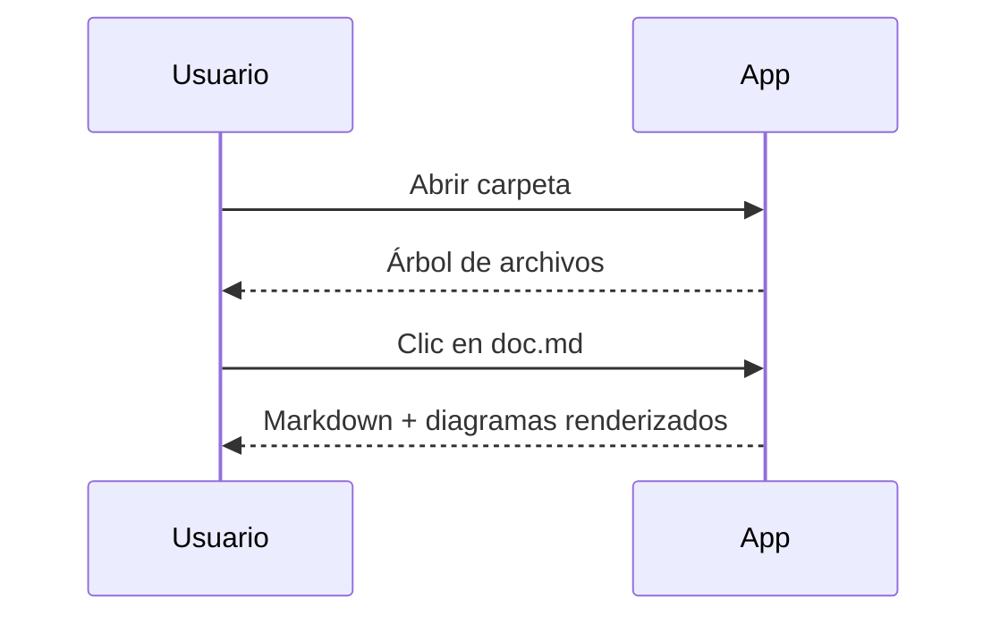

# MD Mermaid Viewer

Visor de escritorio para carpetas de documentación en **Markdown** con renderizado de diagramas **Mermaid**, exportación a **PDF** y a **imagen (SVG/PNG)**.

Pensado para leer documentación técnica local: abres la carpeta del proyecto, navegas por el árbol de archivos y todos los bloques de código ` ```mermaid ` se convierten en diagramas interactivos con zoom, paneo y exportación.


---

## Características

- 📂 **Navegador de documentación**: abre una carpeta y explora su árbol de archivos `.md`, `.markdown`, `.mdown`, `.mkd` y `.mdx`, con filtro de búsqueda (`Ctrl+F`) y arrastrar-y-soltar la carpeta sobre la ventana.
- 🧜 **Mermaid integrado**: todos los bloques ` ```mermaid ` se renderizan en diagramas SVG (flowchart, sequence, class, state, ER, gantt, pie, gitGraph, mindmap, journey, timeline…).
- 🔍 **Diagramas interactivos**: rueda del ratón = zoom al cursor, arrastrar = mover, doble clic = ajustar, botones de acercar/alejar/ajustar y **pantalla completa**.
- 📄 **Exportación a PDF**: con tamaño de papel (A4, A3, Letter, Legal), orientación y paginación con número de página.
- 🖼 **Exportación de diagramas**: individual (SVG vectorial o PNG a 3×) o **todos a la vez** a una carpeta (`Ctrl+Shift+E`).
- 🎨 **Temas**: `default`, `neutral`, `base`, `forest` y `dark` (también oscurece la interfaz).
- 📝 **Markdown completo**: tablas, anclas de encabezados, resaltado de sintaxis con highlight.js y resolución de imágenes/enlaces relativos.
- ↻ **Live reload**: si editas los `.md` con tu editor favorito mientras lees, el documento se recarga solo.
- 🔗 **Enlaces entre documentos**: los enlaces relativos a otros `.md` se abren dentro de la app.
- 🧠 **Recuerda tu sesión**: reabre la última carpeta y el último archivo, conserva tema, tamaño de papel y tamaño/bloqueo de cada lienzo.

## Instalación

Descarga el paquete para tu sistema desde [Releases](../../releases/latest):

| Sistema | Paquete | Instalación |
|---|---|---|
| Linux | `.AppImage` | `chmod +x` y ejecútalo directamente, o |
| Linux | `.deb` | `sudo dpkg -i md-mermaid-viewer_*.deb` |
| Windows | `.exe` (instalador NSIS) | Ejecuta el instalador |

> En Ubuntu 24.04+ (AppArmor estricto) el AppImage incluye un parche para que Chromium arranque sin problemas de sandbox.

### Desde el menú de aplicaciones (Linux)

Tras generar el AppImage (`npm run dist`), puedes registrar la app con icono en tu menú:

```bash
npm run desktop
```

Crea `~/.local/share/applications/md-mermaid-viewer.desktop` con sus iconos y tipos MIME de Markdown.

## Uso

```bash
npm install   # o pnpm install
npm start     # compila el renderer y lanza Electron
```

1. Pulsa **📂 Abrir carpeta** (o arrastra la carpeta a la ventana) — se abre automáticamente el `README.md`, `index.md` o el primer archivo encontrado.
2. Navega por el árbol de la izquierda; usa el filtro para localizar archivos.
3. Interactúa con los diagramas: rueda = zoom, arrastre = paneo, doble clic = ajustar. Cada lienzo se puede **redimensionar** arrastrando su esquina, **bloquear** (para que la rueda vuelva a hacer scroll del documento) y abrir a **pantalla completa**.
4. Exporta con **⬇ PDF** el documento completo, o **🖼 Diagramas…** para volcar todos los diagramas como PNG.

### Atajos

| Atajo | Acción |
|---|---|
| `Ctrl+O` | Abrir carpeta |
| `Ctrl+P` | Exportar a PDF |
| `Ctrl+Shift+E` | Exportar todos los diagramas (PNG) |
| `F5` | Recargar documento |
| `Ctrl+F` | Filtrar archivos en el árbol |
| `Ctrl + / − / 0` | Zoom del visor a pantalla completa |
| `Esc` | Cerrar pantalla completa |

## Ejemplo

Esto en tu `.md`:

````markdown

````

Se muestra como un diagrama interactivo al que puedes hacer zoom y exportar.

## Desarrollo

```bash
npm run watch     # rebuild del renderer en caliente
npm run icons     # genera iconos en build/icons
npm run dist      # empaqueta AppImage/deb (Linux) en dist/
```

- **Stack**: Electron + markdown-it + Mermaid 11 + highlight.js, bundling con esbuild y empaquetado con electron-builder.
- Estructura: `main.js` (proceso principal, IPC, menú, watcher), `preload.js` (API segura vía contextBridge), `renderer/` (UI), `scripts/` (iconos, instalación de escritorio y parche del AppImage).

## Licencia

MIT
